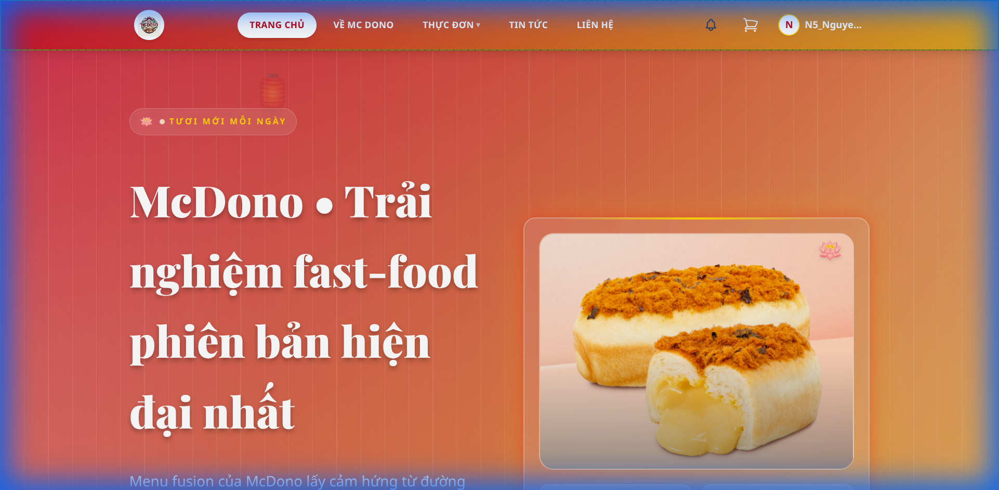
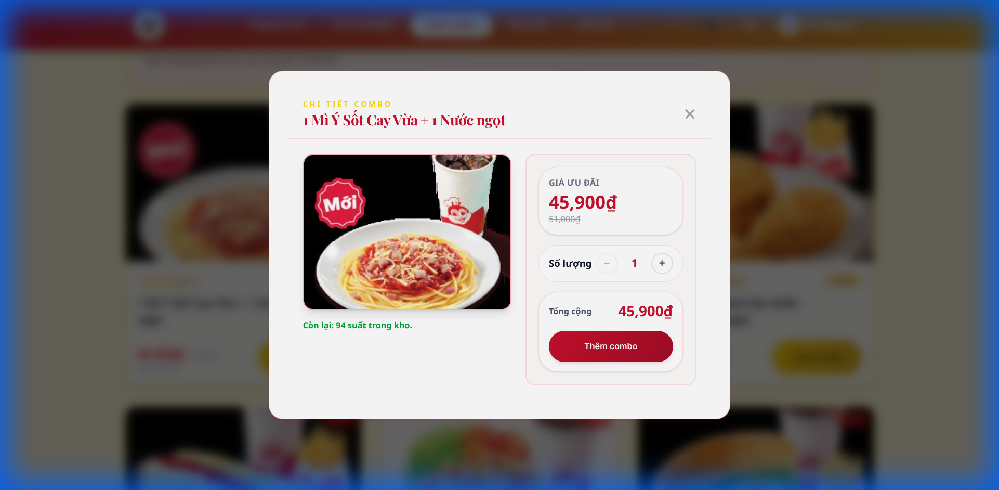
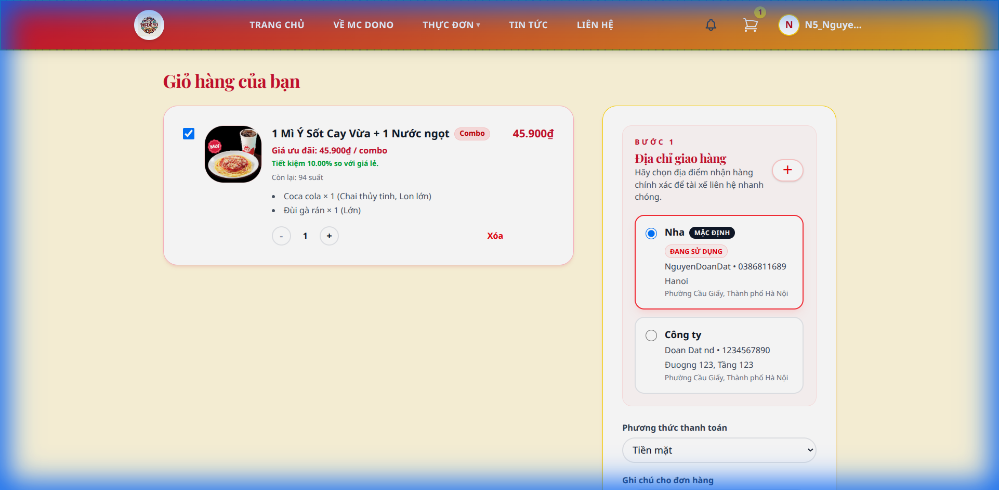

# FastFood Online 🍔

## Introduction
FastFood Online is a modern, responsive web application designed to streamline the food ordering process and enhance the customer experience. Built with a robust **Django** backend and a dynamic **React** frontend, it offers a seamless interface for customers to browse menus, customize orders, and make payments, while providing administrators with powerful tools for managing products, orders, and users.

## Key Features
- **User-Friendly Interface**: An intuitive, responsive design that works perfectly across desktop and mobile devices.
- **Dynamic Menu**: Real-time updates for products, categories, and inventory.
- **Customizable Orders**: Flexible options for toppings, sizes, and special requests.
- **Secure Authentication**: Integrated with **Supabase** for reliable and secure user management.
- **Cart & Checkout**: A smooth shopping cart experience with instant price calculations.
- **Admin Dashboard**: A comprehensive dashboard for managing business operations.

## Tech Stack
- **Backend**: Django, Django REST Framework, PostgreSQL
- **Frontend**: React, Vite, TailwindCSS
- **Infrastructure**: Docker, Nginx, Gunicorn

## Screenshots

### Homepage


### Product Detail


### Shopping Cart


---

## 🚀 Getting Started

You can run FastFood Online locally for development or deploy it to a production server with ease.

### Prerequisites
- [Docker](https://www.docker.com/) and [Docker Compose](https://docs.docker.com/compose/) installed on your machine.

### 1. Configuration
Create environment files from the example template:

```bash
cp .env.example .env
# Edit .env with your credentials if necessary
```

### 2. Local Development (Recommended)
This method runs the full stack (Frontend, Backend, Database) in Docker containers with hot-reloading enabled for development.

1. Start the application:
   ```bash
   docker compose up -d --build
   ```

2. Access the services:
   - **Frontend**: [http://localhost:5173](http://localhost:5173)
   - **Backend API**: [http://localhost:8000](http://localhost:8000)

3. Stop the application:
   ```bash
   docker compose down
   ```

### 3. Production Deployment (1-Click)
For production environments, use the deployment configuration which utilizes optimized images and restart policies.

1. Run the deployment stack:
   ```bash
   docker compose -f docker-compose.deploy.yml up -d --build
   ```

2. The application will be available on port `80` (HTTP):
   - **Web App**: `http://<your-server-ip>`

---

## Manual Setup (Legacy)
If you prefer to run services manually without Docker types:

### Backend
```bash
cd backend
python -m venv .venv
source .venv/bin/activate  # On Windows: .venv\Scripts\activate
pip install -r requirements.txt
python manage.py migrate
python manage.py runserver 8000
```

### Frontend
```bash
cd frontend
npm install
npm run dev
```

---

## Project Structure
- `backend/`: Django project source code.
- `frontend/`: React application source code.
- `docker-compose.yml`: Local development configuration.
- `docker-compose.deploy.yml`: Production deployment configuration.
